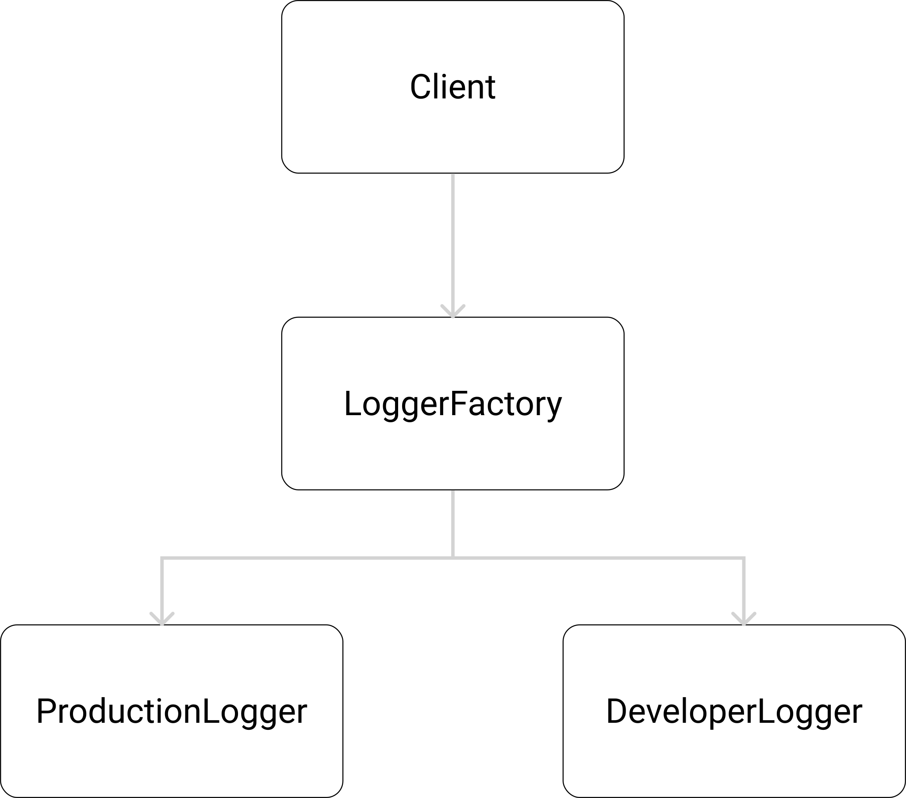

## Abstract-Factory Pattern
Is a way to encapsulate a Group of factories, without specifying their concrete classes.
The client does not know (or care) which concrete objects it gets from each of these internal factories.



#

```js
const logger = createLogger()

logger.info("info message!")
logger.warn("warn message!")
logger.debug("debug message!")
logger.error("err message!")
```

#### Default is Dev:
#### (class)
> npx ts-node Factory_Learning/abstract-factory/factory-tests.ts
#### (function)
> npx ts-node Factory_Learning/abstract-factory/factory-fn-tests.ts

# Flag to test as `production`
#### (class)
> NODE_ENV=production npx ts-node Factory_Learning/abstract-factory/factory-tests.ts
#### (function)
> NODE_ENV=production npx ts-node Factory_Learning/abstract-factory/factory-fn-tests.ts