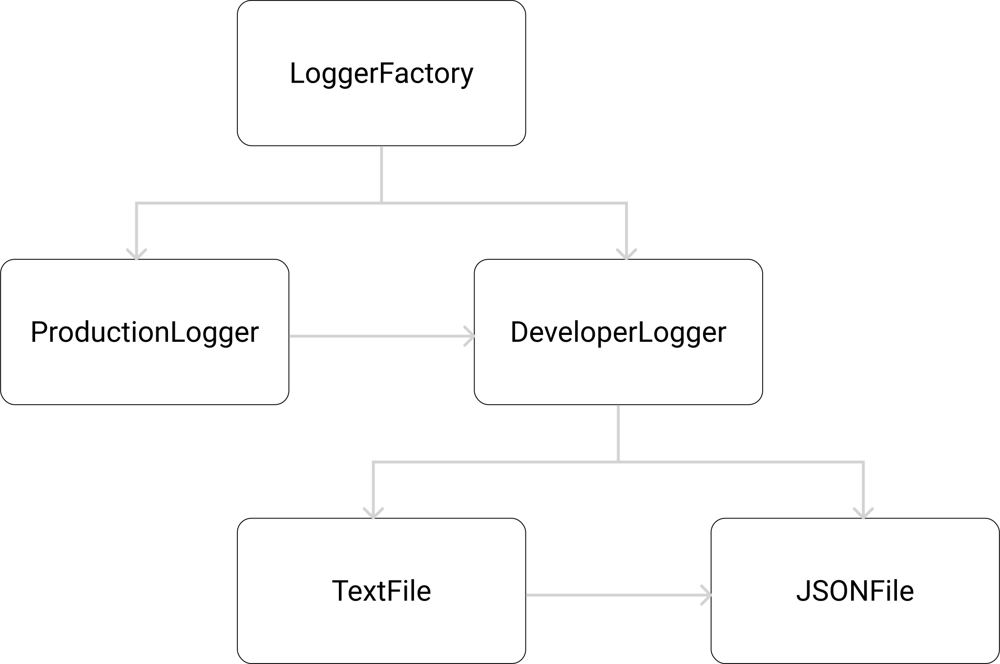

# Builder Pattern
The builder pattern is a design pattern designed to provide a flexible solution to various object creation problems. The intent of the Builder design pattern is to separate the construction of a complex object from its representation.



# 

```js

export class LoggerFactory {
    public static createLogger(): ILogger {
        if (process.env.NODE_ENV === 'production') {
            return new ProductionLogger()
        } else {
            return new DeveloperLogger()
        }
    }
}
```
#### Be Shure to be on the path Factory_Learning/builder
(class)
> npx ts-node dir-scraper-class.ts 

(function)
> npx ts-node dir-scraper-fn.ts 