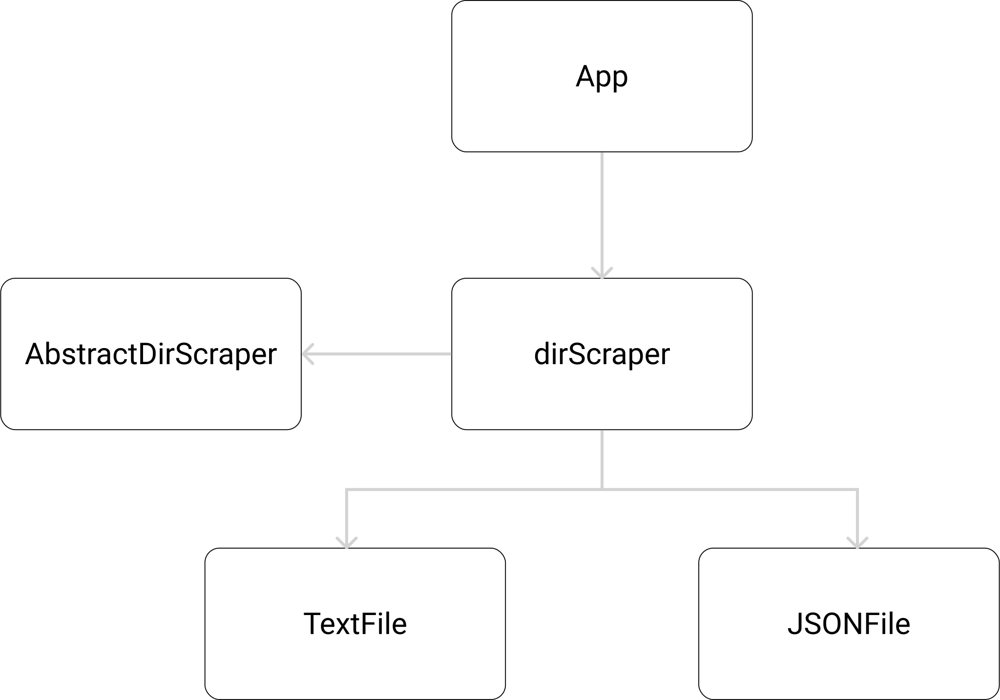

## Abstract-Factory-Abstract Pattern
Is a way to encapsulate a Group of factories, without specifying their concrete classes.
The client does not know (or care) which concrete objects it gets from each of these internal factories.

#

#### Default is Dev:
#### (class)
> npx ts-node dir-scraper-class.ts
#### (function)
> npx ts-node dir-scraper-fn.ts
